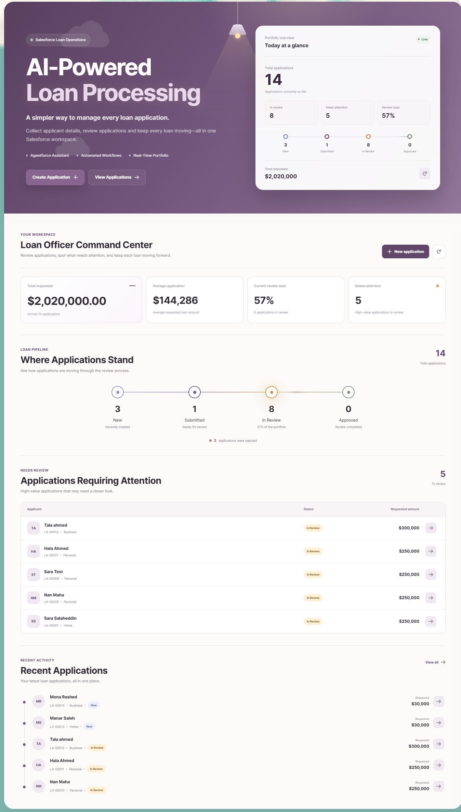
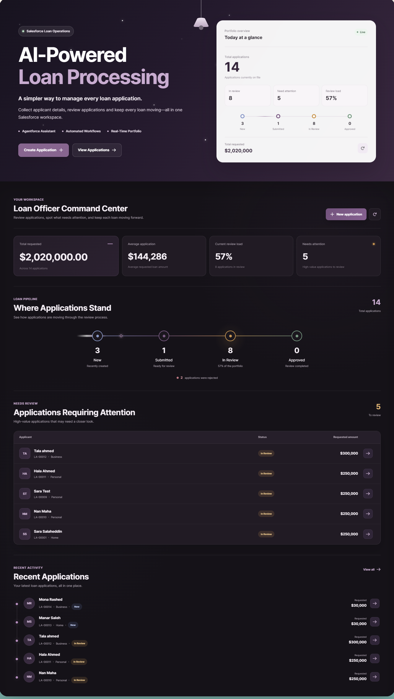
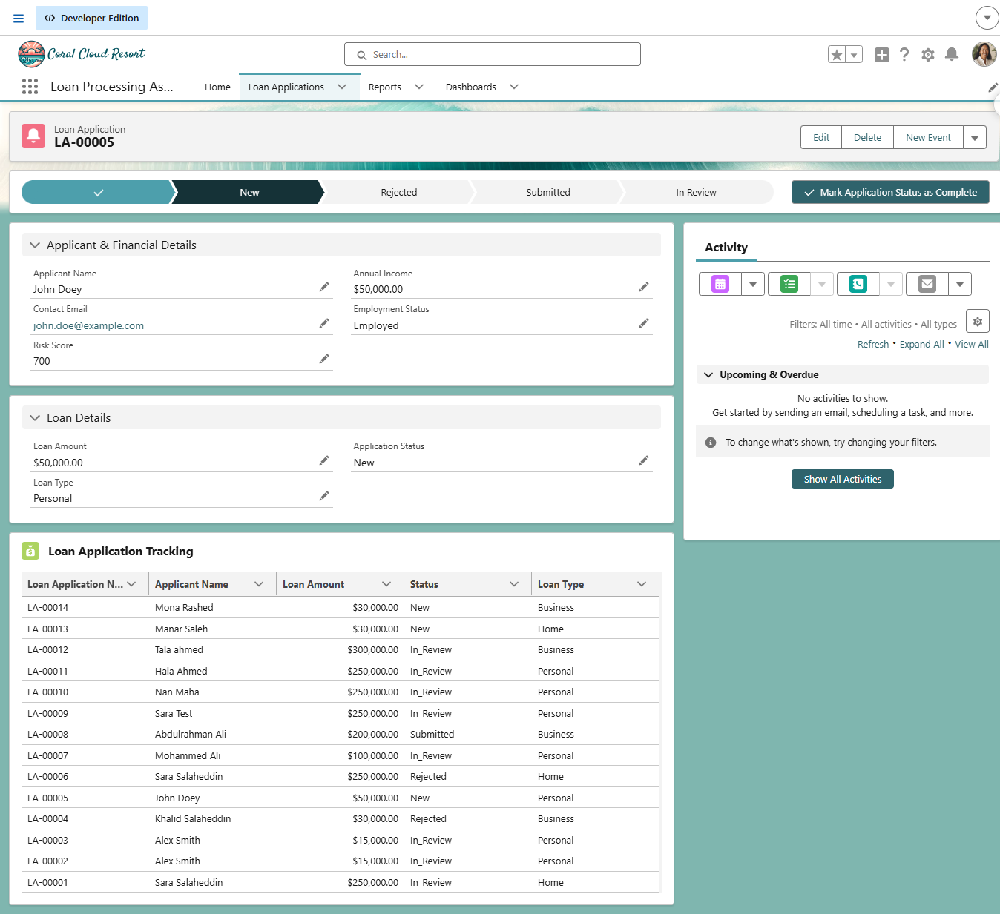
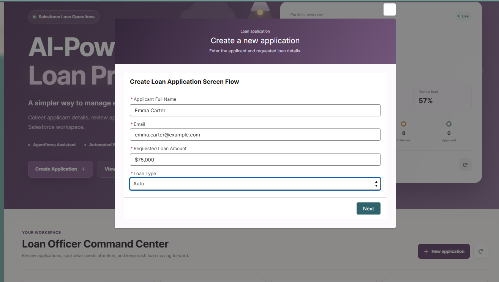
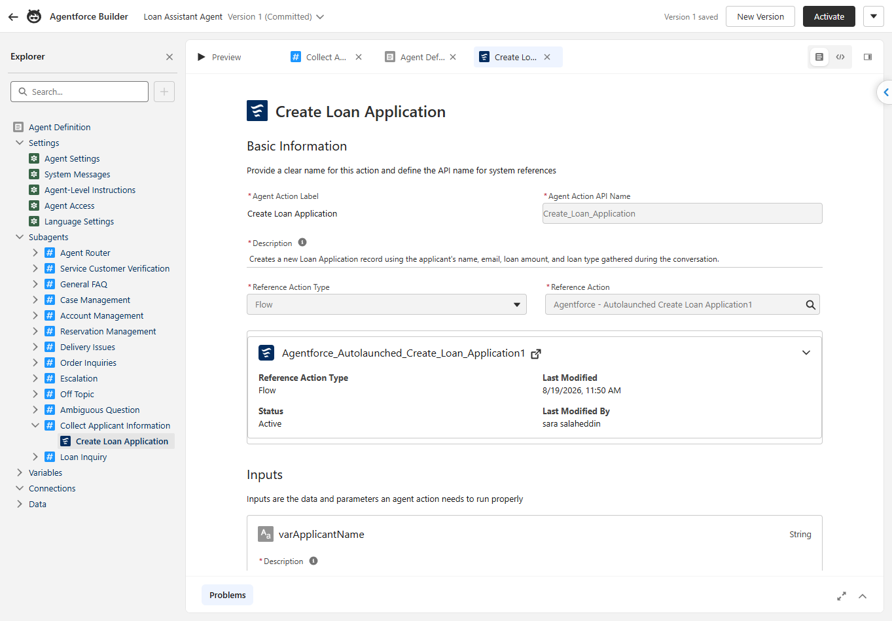
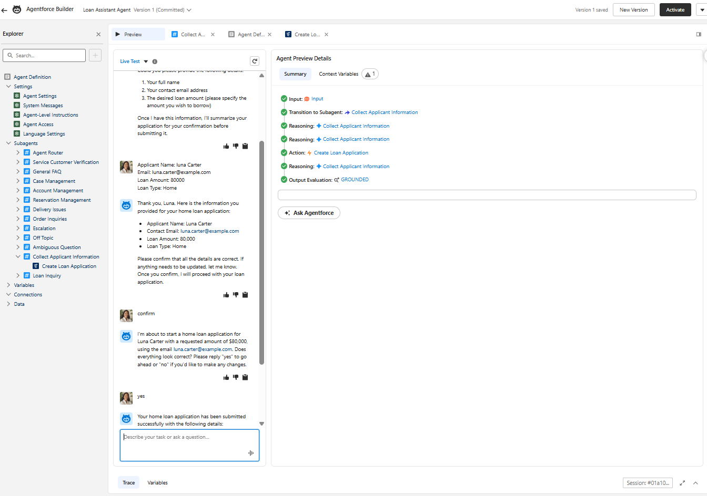
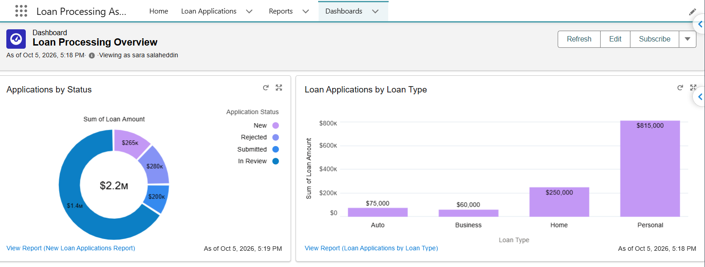

# AI-Powered Loan Processing Assistant

A Salesforce loan processing application that combines Agentforce, Salesforce Flow, Lightning Web Components, Apex, Dynamic Forms, reports, and dashboards.

I built this project to explore how Salesforce automation and conversational AI can work together in a loan processing workflow. The application supports loan intake, record creation, application tracking, high-value application review, and portfolio monitoring from one Salesforce workspace.

---

## Overview

The AI-Powered Loan Processing Assistant provides two ways to create a loan application:

- A guided Salesforce Screen Flow
- A conversational experience through Agentforce

Both paths create records in the custom `Loan_Application__c` object.

Loan officers can then review applications through the Salesforce record page, monitor individual application progress, and use the custom Loan Officer Command Center to see the overall loan portfolio.

The project includes:

- Agentforce loan application intake
- Salesforce Screen Flow
- Agentforce-to-Flow integration
- Record-triggered automation
- Dynamic Lightning record pages
- Custom Lightning Web Components
- Apex data aggregation
- Light and dark workspace modes
- Salesforce reports and dashboards
- Validation and data protection rules

---

## Project Showcase

### Loan Officer Command Center

I built a custom Loan Officer Command Center for the Salesforce Home Page. It gives loan officers a quick view of the current portfolio, application pipeline, high-value applications that need attention, and recent applications.



The Command Center also includes a dark workspace mode.



### Loan Application Record

Each Loan Application record brings together applicant details, loan information, application status, and application tracking.



### Create Loan Application Flow

A new application can be created directly from the Command Center using the Create Loan Application Screen Flow.



### Agentforce Integration

The Loan Assistant Agent includes a `Collect Applicant Information` subagent and a `Create Loan Application` action.

The action is connected to an active autolaunched Salesforce Flow.



The Agentforce preview shows the assistant collecting applicant information, confirming the details with the user, and invoking the Create Loan Application action.



### Reports and Dashboard

The project also uses native Salesforce reporting for portfolio analysis.



---

## Solution Architecture

```text
                         ┌───────────────────────┐
                         │         User          │
                         └───────────┬───────────┘
                                     │
                    ┌────────────────┴────────────────┐
                    │                                 │
                    ▼                                 ▼
          ┌──────────────────┐              ┌──────────────────┐
          │    Agentforce    │              │   Screen Flow    │
          │ Loan Assistant   │              │ Loan Application │
          └────────┬─────────┘              └────────┬─────────┘
                   │                                 │
                   ▼                                 │
          Collect Applicant                          │
             Information                             │
                   │                                 │
                   ▼                                 │
           User Confirmation                         │
                   │                                 │
                   ▼                                 │
        Create Loan Application                      │
               Action                                │
                   │                                 │
                   ▼                                 │
          Autolaunched Flow                          │
                   │                                 │
                   └────────────────┬────────────────┘
                                    │
                                    ▼
                         ┌──────────────────────┐
                         │ Loan_Application__c  │
                         └──────────┬───────────┘
                                    │
              ┌─────────────────────┼─────────────────────┐
              │                     │                     │
              ▼                     ▼                     ▼
      Record-Triggered        Lightning Experience     Reports &
           Flow                                      Dashboard
                                    │
                    ┌───────────────┴───────────────┐
                    │                               │
                    ▼                               ▼
          Loan Officer                    Loan Progress
         Command Center                      Tracker
          LWC + Apex                       Custom LWC
```

The custom Loan Application object acts as the shared data layer between Agentforce, Salesforce Flow, Apex, Lightning Web Components, and Salesforce analytics.

---

## Agentforce — Loan Assistant Agent

The project includes a Salesforce Agentforce assistant for loan application intake and general loan guidance.

### Collect Applicant Information

The `Collect Applicant Information` subagent is used when someone wants to submit a new loan application.

It collects:

- Applicant full name
- Contact email
- Requested loan amount
- Loan type

The agent is instructed to validate the loan amount, ask for missing required information, summarize the collected details, and request confirmation before creating the application.

### Create Loan Application Action

After confirmation, Agentforce invokes the:

```text
Create Loan Application
```

action.

The action is connected to:

```text
Agentforce_Autolaunched_Create_Loan_Application1
```

The following values are passed to the Flow:

```text
varApplicantName
varContactEmail
varLoanAmount
varLoanType
```

The Flow creates the Loan Application record and returns:

```text
varLoanApplicationId
```

The interaction follows this path:

```text
User
  ↓
Loan Assistant Agent
  ↓
Collect Applicant Information
  ↓
Validate Required Information
  ↓
User Confirmation
  ↓
Create Loan Application
  ↓
Autolaunched Flow
  ↓
Loan_Application__c
```

### Loan Inquiry

The `Loan Inquiry` subagent provides general guidance about the loan types supported by the project:

- Personal
- Home
- Auto
- Business

The agent is instructed not to invent interest rates, fees, eligibility requirements, or approval decisions that are not available to it.

### Agentforce Metadata

The Agentforce configuration is included in the Salesforce DX project under:

```text
force-app/main/default/genAiPlannerBundles/Loan_Assistant_Agent_v1/
```

The Planner Bundle contains the agent definition, graph, and supporting local actions required by the Agentforce configuration.

---

## Loan Application Data Model

The main Salesforce object is:

```text
Loan_Application__c
```

### Main Fields

| Field | API Name | Type |
|---|---|---|
| Applicant Name | `Applicant_Name__c` | Text |
| Contact Email | `Contact_Email__c` | Email |
| Annual Income | `Annual_Income__c` | Currency |
| Loan Amount | `Loan_Amount__c` | Currency |
| Loan Type | `Loan_Type__c` | Picklist |
| Application Status | `Application_Status__c` | Picklist |
| Risk Score | `Risk_Score__c` | Number |
| Employment Status | `Employment_Status__c` | Picklist |

### Supported Loan Types

```text
Home
Personal
Auto
Business
```

### Application Lifecycle

```text
New → Submitted → In Review → Approved
                         ↘ Rejected
```

---

## Salesforce Automation

### Create Loan Application Screen Flow

```text
Create_Loan_Application_Screen_Flow
```

The Screen Flow provides a guided way to create a Loan Application.

It collects:

- Applicant Full Name
- Contact Email
- Requested Loan Amount
- Loan Type

The Flow creates a `Loan_Application__c` record with an initial application status of:

```text
New
```

After creation, the Flow displays a confirmation screen with the generated record ID.

The same Screen Flow can be launched directly from the Loan Officer Command Center.

### Agentforce Autolaunched Flow

```text
Agentforce_Autolaunched_Create_Loan_Application1
```

This Flow connects the Agentforce action to Salesforce record creation.

It receives the applicant information collected during the Agentforce conversation and creates the corresponding Loan Application record.

### High-Value Loan Automation

```text
Loan_Application_Auto_Update_High_Value_Status
```

This record-triggered Flow handles high-value applications.

Loan requests of `100,000` or more are moved into the review process through an application status update.

---

## Lightning Experience

The project includes the custom Salesforce application:

```text
Loan Processing Assistant
```

### Loan Application Record Page

The custom:

```text
Loan Application Record Page
```

organizes the record into sections such as:

- Applicant & Financial Details
- Loan Details

Dynamic Forms and visibility rules are used to make the record page more contextual.

### Salesforce Home Page

The project also includes the custom Home Page:

```text
Home_Page_Default1
```

This page hosts the Loan Officer Command Center together with native Salesforce reporting components.

---

## Loan Officer Command Center

The Loan Officer Command Center is a custom Lightning Web Component backed by Apex.

I added it to give loan officers a single place to monitor the loan portfolio instead of opening individual records or reports for every check.

### Portfolio Overview

The workspace displays:

- Total applications
- Total requested amount
- Average loan amount
- New applications
- Submitted applications
- Applications in review
- Approved applications
- Rejected applications

### Application Journey

The application pipeline is displayed visually:

```text
New → Submitted → In Review → Approved
                         ↘ Rejected
```

### Applications Requiring Attention

The `Needs Your Attention` section surfaces active applications with requested loan amounts of `100,000` or more for closer review.

This is workflow prioritization, not an automated lending decision.

### Recent Applications

The recent applications section lets a loan officer quickly see:

- Recent records
- Current status
- Requested amount
- Loan type

Users can also navigate directly to a Loan Application record or open the full Loan Applications list.

### Create Application

The Command Center can launch the existing Create Loan Application Screen Flow without leaving the workspace.

### Refresh

The refresh action retrieves the latest portfolio data from Salesforce.

---

## Interactive Workspace

The Command Center includes light and dark workspace modes controlled by a custom lamp interaction.

The visual experience includes:

- Light workspace
- Dark workspace
- CSS-based lamp
- Animated daytime clouds
- Night sky and star effects
- Shooting-star animation
- Responsive layout behavior
- Reduced-motion support

The theme applies to the custom LWC. Native Salesforce report components remain styled by Salesforce.

---

## Custom Lightning Web Components

Two custom LWCs are included in the project.

### `loanOfficerCommandCenter`

The main portfolio workspace.

It uses Apex to retrieve and display:

- Portfolio metrics
- Application status information
- Application pipeline
- High-value applications requiring attention
- Recent applications

It also handles record navigation, refresh behavior, and Screen Flow launch.

```text
loanOfficerCommandCenter/
├── loanOfficerCommandCenter.css
├── loanOfficerCommandCenter.html
├── loanOfficerCommandCenter.js
└── loanOfficerCommandCenter.js-meta.xml
```

### `loanProgressTracker`

The record-level tracking component displayed as:

```text
Loan Application Tracker (Custom LWC)
```

It provides a visual view of application status from the Loan Application record page.

```text
loanProgressTracker/
├── loanProgressTracker.html
├── loanProgressTracker.js
└── loanProgressTracker.js-meta.xml
```

Together, the two components provide portfolio-level monitoring and record-level tracking.

---

## Apex Integration

The Loan Officer Command Center uses:

```text
LoanOfficerCommandCenterController
```

The controller provides the portfolio data needed by the LWC, including:

- Total applications
- Counts by application status
- Total requested amount
- Average loan amount
- Applications requiring attention
- Recent applications

The project also includes:

```text
LoanOfficerCommandCenterControllerTest
```

The final Apex test run completed with:

```text
Tests Ran: 2
Pass Rate: 100%
Fail Rate: 0%
```

---

## Data Protection

The project includes the validation rule:

```text
Prevent_Manual_Risk_Score_Edit
```

It protects `Risk_Score__c` from unauthorized manual changes and helps keep system-managed information consistent.

Additional Salesforce access controls and field-level security can be used to control access to sensitive application data according to user responsibilities.

---

## Reports & Dashboard

The project uses native Salesforce reports alongside the custom Command Center.

### Reports

#### Loan Applications by Loan Type

```text
Loan_Applications_by_Loan_Type_0KE
```

Shows Loan Application data grouped by loan type.

#### New Loan Applications Report

```text
New_Loan_Applications_Report_nBu
```

Provides a status-based view of Loan Application records and is used by the dashboard.

### Dashboard

The:

```text
Loan Processing Overview
```

dashboard provides visual analysis of application status and loan type using Salesforce report data.

---

## Testing

I tested the main application paths across:

- Screen Flow application creation
- Agentforce applicant information collection
- Agentforce confirmation
- Agentforce-to-Flow integration
- Loan Application record creation
- High-value application automation
- Loan Officer Command Center
- Loan Progress Tracker
- Record navigation
- Command Center refresh
- Screen Flow launch from the Command Center
- Validation rule behavior
- Reports and dashboard

The Apex test suite completed with:

```text
2 tests
100% pass rate
0 failures
```

More detailed testing notes are available in:

```text
docs/testing.md
```

---

## Technology Stack

| Technology | Use |
|---|---|
| Salesforce Platform | Core application platform |
| Salesforce Agentforce | Conversational loan assistant |
| Salesforce Flow Builder | Intake and workflow automation |
| Lightning App Builder | Home and record page configuration |
| Dynamic Forms | Contextual record experience |
| Lightning Web Components | Custom UI and application tracking |
| Apex | Server-side data aggregation |
| Salesforce Reports | Loan data analysis |
| Salesforce Dashboards | Portfolio visualization |
| Salesforce CLI | Metadata retrieval and deployment |
| Salesforce DX | Source-driven project structure |
| Git | Version control |
| GitHub | Source repository |

---

## Project Structure

```text
force-app/main/default/
│
├── applications/
│   └── Loan_Processing_Assistant.app-meta.xml
│
├── classes/
│   ├── LoanOfficerCommandCenterController.cls
│   ├── LoanOfficerCommandCenterController.cls-meta.xml
│   ├── LoanOfficerCommandCenterControllerTest.cls
│   └── LoanOfficerCommandCenterControllerTest.cls-meta.xml
│
├── dashboards/
│   └── PublicDashboards/
│
├── flexipages/
│   ├── Home_Page_Default1.flexipage-meta.xml
│   ├── Loan_Application_Record_Page.flexipage-meta.xml
│   └── Loan_Processing_Assistant_UtilityBar.flexipage-meta.xml
│
├── flows/
│   ├── Agentforce_Autolaunched_Create_Loan_Application1.flow-meta.xml
│   ├── Create_Loan_Application_Screen_Flow.flow-meta.xml
│   └── Loan_Application_Auto_Update_High_Value_Status.flow-meta.xml
│
├── genAiPlannerBundles/
│   └── Loan_Assistant_Agent_v1/
│
├── lwc/
│   ├── loanOfficerCommandCenter/
│   │   ├── loanOfficerCommandCenter.css
│   │   ├── loanOfficerCommandCenter.html
│   │   ├── loanOfficerCommandCenter.js
│   │   └── loanOfficerCommandCenter.js-meta.xml
│   │
│   └── loanProgressTracker/
│       ├── loanProgressTracker.html
│       ├── loanProgressTracker.js
│       └── loanProgressTracker.js-meta.xml
│
├── objects/
│   └── Loan_Application__c/
│       ├── fields/
│       ├── listViews/
│       └── validationRules/
│
└── reports/
    └── unfiled$public/
```

Additional project documentation is available in:

```text
docs/
├── architecture.md
├── security.md
├── testing.md
└── screenshots/
```

---

## Responsible AI & Scope

Agentforce is used to guide the conversation, collect structured information, request confirmation, and trigger Salesforce automation.

It is not used to independently determine creditworthiness or make real-world lending decisions.

The current project does not include:

- External credit bureau integration
- Production credit scoring
- Automated document verification
- Core banking integration
- Predictive lending models

A production lending system would require additional security, regulatory compliance, governance, validation, and human oversight.

---

## Future Enhancements

Possible next steps for the project include:

- Credit bureau API integration
- Document upload and verification
- Loan officer notifications
- More advanced review workflows
- Additional Agentforce actions
- Expanded analytics
- External banking system integration
- Advanced risk assessment

---

## Author

**Sara Salaheddin**